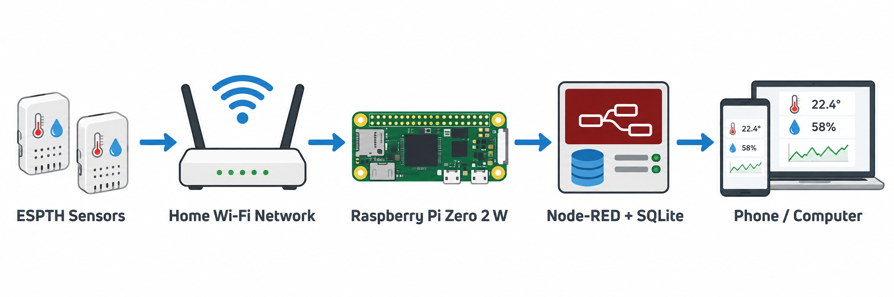

# Raspberry Pi Zero 2 W Standalone Dashboard

This guide turns a Raspberry Pi Zero 2 W into an always-on local server for the ESP32 Home Temperature Sensors project. The Pi receives MQTT readings from the sensors, saves them in a SQLite database, and hosts a Node-RED Dashboard 2.0 page for phones and computers on the same home network.



The architecture illustration was generated with OpenAI image generation and is included as a project diagram, not a photograph of the supplied hardware.

## Contents

- [What you will build](#what-you-will-build)
- [Parts and accounts](#parts-and-accounts)
- [Flash Raspberry Pi OS](#flash-raspberry-pi-os)
- [Find the Pi and connect with SSH](#find-the-pi-and-connect-with-ssh)
- [Update the Pi and install base packages](#update-the-pi-and-install-base-packages)
- [Set up Mosquitto MQTT](#set-up-mosquitto-mqtt)
- [Set up Node-RED, Dashboard 2.0, and SQLite](#set-up-node-red-dashboard-20-and-sqlite)
- [Import and configure the standalone flow](#import-and-configure-the-standalone-flow)
- [Open the dashboard from a phone or computer](#open-the-dashboard-from-a-phone-or-computer)
- [Optional OpenWeather integration](#optional-openweather-integration)
- [Troubleshooting](#troubleshooting)

## What you will build

```text
ESPTH / ESPTHSC sensors -> home Wi-Fi -> Raspberry Pi
                                          |- Mosquitto MQTT broker
                                          |- SQLite history database
                                          `- Node-RED Dashboard 2.0
                                                        |
                                                        `-> phone or computer browser
```

The Pi is the central local computer for this setup. It should remain powered and connected to your normal home network. This guide uses MQTT on TCP `1883` and Node-RED on TCP `1880`. Do not forward either port from your internet router.

The supplied [pi-zero-2w-standalone-flow.json](pi-zero-2w-standalone-flow.json) is an importable Node-RED flow. It does not replace existing Node-RED flows.

## Parts and accounts

- Raspberry Pi Zero 2 W, case, and a quality microSD card of at least 16 GB.
- A stable 5 V, 2.5 A micro-USB power supply for the Pi.
- A computer running macOS, Windows, or Linux with an SD-card reader.
- Your Wi-Fi name and password. The Pi Zero 2 W supports 2.4 GHz Wi-Fi; ensure the network you enter in Raspberry Pi Imager is reachable on 2.4 GHz.
- The ESPTH or ESPTHSC sensors already assembled and ready to have their MQTT settings updated.

You will choose a Pi username, Pi password, and MQTT password during setup. Keep each private. Do not add them to this repository, screenshots, or exported Node-RED flows.

## Flash Raspberry Pi OS

Use **Raspberry Pi OS Lite (64-bit)**. It has no desktop environment, leaving more of the Pi's limited memory for the broker, database, and dashboard. The same imaging steps work from all three computer operating systems.

### macOS

1. Download [Raspberry Pi Imager](https://www.raspberrypi.com/software/) for macOS.
2. Open the downloaded installer and move Raspberry Pi Imager to Applications when prompted.
3. Open Raspberry Pi Imager from Applications.

### Windows

1. Download [Raspberry Pi Imager](https://www.raspberrypi.com/software/) for Windows.
2. Run the downloaded installer, accept the defaults, and open Raspberry Pi Imager from the Start menu.

### Linux

1. Download Raspberry Pi Imager from the official [Raspberry Pi software page](https://www.raspberrypi.com/software/).
2. On Debian, Ubuntu, Raspberry Pi OS, or another Debian-based distribution, you can also install it with:

```bash
sudo apt update
sudo apt install -y rpi-imager
rpi-imager
```

3. If your Linux distribution is not Debian-based, use the package or download linked on the Raspberry Pi software page.

### Write the card

1. Insert the microSD card into your computer.
2. In Raspberry Pi Imager, choose **Raspberry Pi Device** and select **Raspberry Pi Zero 2 W**.
3. Choose **Raspberry Pi OS (other)**, then choose **Raspberry Pi OS Lite (64-bit)**.
4. Choose the microSD card under **Storage**. Carefully verify the selected drive: Imager erases it.
5. Click **Next**. When Imager offers to customize the OS, choose **Edit Settings**.
6. On the **General** tab:
   - Set hostname to `tempsensor-pi`.
   - Set a username. In this guide, replace `YOUR_PI_USERNAME` with that exact username whenever it appears.
   - Set a strong password.
   - Enter your Wi-Fi network name and password, then choose your correct Wi-Fi country.
7. On the **Services** tab, enable **SSH** and choose **Use password authentication**. SSH keys are stronger, but password authentication is easier for a first setup.
8. Save the settings, choose **Yes** to write, and wait for writing and verification to finish.
9. Eject the card, insert it in the Pi, and connect power. Wait about two minutes for the first boot.

The hostname, Wi-Fi settings, username, and SSH setting are written privately to the new SD card. They are not part of this project or its example files.

## Find the Pi and connect with SSH

The hostname chosen above lets most home networks find the Pi as `tempsensor-pi.local`. The command below should print an IP address in its first line.

### macOS

Open Terminal and run:

```bash
ping -c 1 tempsensor-pi.local
```

Connect with:

```bash
ssh YOUR_PI_USERNAME@tempsensor-pi.local
```

### Windows

Open PowerShell and run:

```powershell
ping -n 1 tempsensor-pi.local
```

Connect with:

```powershell
ssh YOUR_PI_USERNAME@tempsensor-pi.local
```

### Linux

Open a terminal and run:

```bash
ping -c 1 tempsensor-pi.local
```

Connect with:

```bash
ssh YOUR_PI_USERNAME@tempsensor-pi.local
```

On the first SSH connection, type `yes` when asked whether to trust the Pi's host key, then enter the Pi password you created in Imager. You are now entering commands on the Pi itself; all remaining terminal commands in this guide are identical regardless of whether you started from a Mac, Windows PC, or Linux computer.

If `tempsensor-pi.local` does not resolve, open your router's connected-device list and find the device named `tempsensor-pi`, then use its IP address instead:

```bash
ssh YOUR_PI_USERNAME@YOUR_PI_IP_ADDRESS
```

After connecting, record the Pi's current network address with:

```bash
hostname -I
```

Use the first address on your home network in the ESPHome MQTT configuration and browser addresses below. A router may assign a different address later; reserve this address in the router if it offers DHCP reservations.

## Update the Pi and install base packages

Run these commands in the Pi SSH session:

```bash
sudo apt update
sudo apt full-upgrade -y
sudo reboot
```

The SSH connection will close during reboot. Wait about one minute, reconnect using the SSH command above, then install the packages needed by Mosquitto, SQLite, and Node-RED:

```bash
sudo apt install -y mosquitto mosquitto-clients sqlite3 build-essential git curl
```

Confirm the Pi has the correct local time before storing readings:

```bash
timedatectl status
```

If the time zone is wrong, set it interactively:

```bash
sudo raspi-config
```

Choose **5 Localisation Options**, then **L2 Timezone**, select your region and city, then finish and reboot if prompted.

## Set up Mosquitto MQTT

Mosquitto receives messages from the ESP32 sensors. This guide uses a dedicated MQTT account and allows connections only through the Pi's normal local network interface.

### 1. Create an MQTT account

Run this command and enter a new MQTT password when prompted. Do not use a password you intend to publish anywhere.

```bash
sudo mosquitto_passwd -c /etc/mosquitto/temperature-sensors.passwd temperature_sensor
```

### 2. Create the broker configuration

Copy and paste this complete block into the Pi SSH session:

```bash
sudo tee /etc/mosquitto/conf.d/temperature-sensors.conf > /dev/null <<'EOF'
listener 1883
allow_anonymous false
password_file /etc/mosquitto/temperature-sensors.passwd
EOF
```

Set safe file ownership and start the broker:

```bash
sudo chown root:mosquitto /etc/mosquitto/temperature-sensors.passwd
sudo chmod 640 /etc/mosquitto/temperature-sensors.passwd
sudo systemctl enable --now mosquitto
sudo systemctl restart mosquitto
sudo systemctl status mosquitto --no-pager
```

The last command should show `active (running)`. Press `q` if it opens a long status view.

### 3. Test MQTT locally

Open a second SSH session to the Pi. In the first session, start a subscriber. Replace `YOUR_MQTT_PASSWORD` with the password just created:

```bash
mosquitto_sub -h localhost -p 1883 -u temperature_sensor -P 'YOUR_MQTT_PASSWORD' -t 'test/temperature' -v
```

In the second SSH session, publish a test reading:

```bash
mosquitto_pub -h localhost -p 1883 -u temperature_sensor -P 'YOUR_MQTT_PASSWORD' -t 'test/temperature' -m '72.4'
```

The first session should show `test/temperature 72.4`. Press `Ctrl+C` there after the test. The `-P` examples place a password in command history, so do not share that terminal history or screenshots.

### 4. Point the ESP32 sensors at the Pi

In the private `firmware/secrets.yaml` used to build each sensor, set these values before flashing or sending an OTA update:

```yaml
mqtt_broker: "YOUR_PI_IP_ADDRESS"
mqtt_username: "temperature_sensor"
mqtt_password: "YOUR_MQTT_PASSWORD"
```

Keep `port: 1883` in the public ESPHome YAML. Use the Pi's LAN IP address rather than `localhost`; on an ESP32, `localhost` would mean the ESP32 itself. The screen firmware has MQTT commented out by default, so enable its MQTT block and telemetry publish action before expecting ESPTHSC readings on the Pi.

To watch all messages after flashing a sensor, run this on the Pi:

```bash
mosquitto_sub -h localhost -p 1883 -u temperature_sensor -P 'YOUR_MQTT_PASSWORD' -t '#' -v
```

You should see `espth-1/sensor/.../state` messages from the no-screen sensor or `<device_name>/telemetry` JSON messages from a screen sensor with MQTT enabled.

## Set up Node-RED, Dashboard 2.0, and SQLite

### 1. Install Node-RED as a Pi service

Run Node-RED's official Debian/Raspberry Pi installer. It installs Node.js and Node-RED, then configures Node-RED to run as a service:

```bash
bash <(curl -sL https://github.com/node-red/linux-installers/releases/latest/download/install-update-nodered-deb)
```

Read each installer prompt. When it finishes, start the service and view its log:

```bash
node-red-start
```

Wait until the log says Node-RED is running, then press `Ctrl+C`. This only closes the log view; the service keeps running in the background. Check it at any time with:

```bash
node-red-log
```

### 2. Install the dashboard and SQLite nodes

The flow requires the current FlowFuse Dashboard 2.0 package and the official Node-RED SQLite node. Run:

```bash
node-red-stop
cd "$HOME/.node-red"
npm install @flowfuse/node-red-dashboard node-red-node-sqlite
node-red-start
```

Wait for the service log to report that Node-RED is running, then press `Ctrl+C` to leave the log view. The dashboard is now available to the Pi's home network; it is not exposed to the public internet unless you deliberately change your router or firewall configuration.

### 3. Prepare the database location

Create a private directory for the database. This command also prints the exact path you will place in the Node-RED SQLite configuration:

```bash
mkdir -p "$HOME/temperature-dashboard"
printf '%s\n' "$HOME/temperature-dashboard/temperature-sensors.db"
```

The imported flow creates the tables and index automatically when deployed. You can confirm that SQLite can open the file with:

```bash
sqlite3 "$HOME/temperature-dashboard/temperature-sensors.db" '.databases'
```

## Import and configure the standalone flow

### 1. Open Node-RED

From a computer or phone on the same home network, open:

```text
http://YOUR_PI_IP_ADDRESS:1880
```

The first time you open it, Node-RED may show a welcome screen. You should see the flow editor, with a node palette on the left and workspace in the center.

### 2. Import the flow

1. Download [pi-zero-2w-standalone-flow.json](pi-zero-2w-standalone-flow.json) from this folder to the computer you are using.
2. In Node-RED, select the menu in the upper-right corner, then choose **Import**.
3. Choose **select a file to import**, select the downloaded JSON file, then click **Import**.
4. Place the imported **Pi Temperature Dashboard** tab in the workspace and click **Import** again if Node-RED asks for placement.

The flow adds a tab to Node-RED. It does not replace your other flows.

### 3. Set the SQLite database path

1. On the **Pi Temperature Dashboard** tab, double-click any purple **SQLite** node.
2. Next to **Database**, click the pencil icon.
3. In the file path field, replace `YOUR_PI_USERNAME` with the username you chose in Raspberry Pi Imager. The completed path must be:

```text
/home/YOUR_PI_USERNAME/temperature-dashboard/temperature-sensors.db
```

4. Set the database mode to **Read/Write/Create** if it is not already selected.
5. Click **Update**, then **Done**.

All SQLite nodes share that one database configuration, so this change applies to the whole flow.

### 4. Set MQTT credentials

1. Double-click the **All sensor MQTT messages** node.
2. Next to **Pi Mosquitto**, click the pencil icon.
3. Leave the server as `localhost` and port as `1883`. Mosquitto and Node-RED run on the same Pi.
4. Open the **Security** tab and enter username `temperature_sensor` and the MQTT password you created earlier.
5. Click **Update**, then **Done**.

### 5. Assign a location to each sensor

1. Double-click the **Normalize, locate, and store** function node.
2. At the top of the code, edit only the `locations` section. For example:

```javascript
const locations = {
    "espth-1": "Living Room",
    "espth-2": "Bedroom",
    "espthsc-1": "Desk Display"
};
```

Each key must exactly match the device name in that sensor's ESPHome YAML. The value is the human-readable name shown on the dashboard and saved in the database. Unknown sensor names are stored as `Unassigned (<device name>)`, making a missing assignment easy to spot.

### 6. Deploy and confirm storage

1. Click **Deploy** in the upper-right corner.
2. The **Initialize SQLite tables** node runs automatically once after deployment.
3. Watch the status under **All sensor MQTT messages**. It should change to `connected`.
4. Wait for a sensor reading. ESPTHSC telemetry is normally every minute when MQTT is enabled; ESPTH samples every 15 minutes.

The flow stores each valid MQTT update in SQLite. For separate ESPTH temperature and humidity state messages, two closely spaced records can be stored as the values arrive; the dashboard keeps the latest known temperature and humidity together.

To inspect the newest stored records directly on the Pi, run:

```bash
sqlite3 -header -column "$HOME/temperature-dashboard/temperature-sensors.db" "SELECT recorded_at, sensor_id, location, temperature_f, humidity_percent FROM sensor_readings ORDER BY id DESC LIMIT 10;"
```

## Open the dashboard from a phone or computer

Open this address while connected to the same home network:

```text
http://YOUR_PI_IP_ADDRESS:1880/dashboard/temperature-history
```

The page shows:

- The location, temperature, humidity, and timestamp from the most recently received sensor reading.
- A temperature history chart for the last 24 hours, with a separate line for each assigned location.
- A humidity history chart for the last 24 hours.
- Empty optional weather fields until OpenWeather is enabled.

On a phone, save the dashboard URL as a home-screen bookmark if you want it to behave like a small local app. Do not use a guest Wi-Fi network: guest networks often prevent phones from reaching the Pi.

## Optional OpenWeather integration

This part is optional. It fetches current outdoor weather from OpenWeather every 15 minutes, stores it in the same SQLite database, and shows it on the dashboard. It requires an OpenWeather account, API key, internet access for the Pi, and the coordinates you choose to share with OpenWeather.

1. Create an API key through [OpenWeather](https://openweathermap.org/api). Review its current plan, service terms, and privacy information before use.
2. In Node-RED, open the **Optional OpenWeather** tab. It is disabled by default.
3. Enable the tab, then double-click **Set OpenWeather request details**.
4. Replace the three placeholders at the top of the function with your API key, latitude, and longitude. Do not put those values into this repository or re-exported public flow.
5. Click **Done**, then **Deploy**.

The optional tab updates the **Outdoor Weather** group on the dashboard and writes rows to `weather_readings`. To verify the rows from SSH:

```bash
sqlite3 -header -column "$HOME/temperature-dashboard/temperature-sensors.db" "SELECT recorded_at, location, temperature_f, humidity_percent, description FROM weather_readings ORDER BY id DESC LIMIT 10;"
```

If you do not need outdoor weather, leave the tab disabled. The indoor sensor, database, and dashboard remain fully local.

## Troubleshooting

| Symptom | What to check |
| --- | --- |
| The Pi never appears on the network | Confirm the SD-card image used the correct Wi-Fi name, password, and country. The Pi Zero 2 W needs 2.4 GHz Wi-Fi. Check power, wait two minutes, then look for `tempsensor-pi` in the router's connected-device list. |
| SSH says connection refused or times out | Confirm SSH was enabled in Raspberry Pi Imager. Use the Pi's IP address instead of `.local`. Reflash with SSH enabled if necessary. |
| `mosquitto` is not active | Run `sudo systemctl status mosquitto --no-pager` and then `sudo journalctl -u mosquitto -n 50 --no-pager`. Recheck the configuration block and password-file permissions. |
| A sensor cannot connect to MQTT | Ensure its private `secrets.yaml` uses the Pi's LAN IP, port `1883`, and the same MQTT username/password. `localhost` is wrong in sensor firmware. Check the live broker with the `mosquitto_sub` command above. |
| Node-RED does not start | Run `node-red-log`. If memory is tight, the Pi installer provides `node-red-pi --max-old-space-size=256` for a foreground diagnostic run. Do not run two Node-RED instances on the same port. |
| Imported nodes say unknown or are red | On the Pi, run the Dashboard and SQLite install command again, then restart Node-RED. The flow needs `@flowfuse/node-red-dashboard` and `node-red-node-sqlite`. |
| SQLite reports it cannot open the database | Re-open the shared SQLite configuration node. Its path must use your actual Pi username and point to the directory created with `mkdir -p "$HOME/temperature-dashboard"`. |
| Dashboard opens but has no readings | Confirm the MQTT node says `connected`, then run the all-topics `mosquitto_sub` command on the Pi. Confirm the device name in the MQTT topic matches one supported by the normalizing function. Wait for the sensor's sample interval. |
| Dashboard location says `Unassigned (...)` | Add that exact device name to the `locations` object in **Normalize, locate, and store**, then deploy. |
| Charts are blank after restarting Node-RED | Confirm `sensor_readings` contains records with the SQLite query above. The flow loads the previous 24 hours on deployment; browser refresh or redeploy after fixing the database path. |
| OpenWeather shows no values | Keep the optional tab enabled, confirm the three placeholders were replaced, and check Node-RED's Debug sidebar or `node-red-log` for an HTTP/API error. |
| A phone cannot open the dashboard | Connect the phone to the normal home Wi-Fi, not cellular or guest Wi-Fi. Use `http://YOUR_PI_IP_ADDRESS:1880/dashboard/temperature-history`, not `localhost`. |

For broader MQTT testing and an intentionally small one-sensor example, see the [basic testing flow](../basic_testing/). Firmware setup and private sensor configuration are covered in the [firmware guide](../../firmware/README.md).

This guide and flow were developed with AI assistance and are offered under [GPL-3.0-only](../../LICENSE). See [NOTICE.md](../../NOTICE.md) for attribution, third-party terms, and limitations.
